# DevSecOps CI/CD Pipeline for Full Stack Chat Application

This project demonstrates a **complete DevSecOps workflow** for deploying a full-stack chat application using **Terraform, Ansible, Jenkins, Docker, Kubernetes, ArgoCD, Prometheus, and Grafana**.

The system automates **infrastructure provisioning, CI/CD, security scanning, containerization, GitOps deployment, and monitoring**.

---

# 1. Local Development (Docker Compose)

Before deploying through the CI/CD pipeline, the application can be tested locally using **Docker Compose**.

## Services

The `docker-compose.yml` defines three services:

- **MongoDB** – Database with persistent storage and health check  
- **Backend** – Node.js API connected to MongoDB  
- **Frontend** – Web interface served via Nginx  

All services run inside a shared Docker network for internal communication.

## Run the Application

```bash
docker compose up -d
```

## Access the Application

- **Frontend:** http://localhost:8081  
- **Backend API:** http://localhost:5001  
- **MongoDB:** localhost:27017  

### Docker Compose


---

# 2. Infrastructure Provisioning (Terraform)

Terraform provisions the AWS infrastructure required for the DevOps environment.

## Infrastructure Configuration

- **AWS Provider** – Connects Terraform to AWS in the specified region  
- **Default VPC** – Uses the default VPC in the AWS account  
- **Default Security Group** – Applies the default security group  

## EC2 Instance

- Instance type: **t3.large**
- Public IP enabled
- SSH key pair for access
- **30 GB gp3 root volume**

## Additional Configuration

- **Tags** – Instance named `devops-kind-server`
- **Output** – Displays the public IP address used later in the Ansible inventory

### Terraform Infrastructure

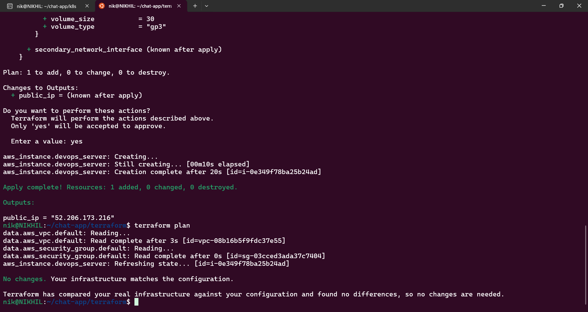

### Terraform Output

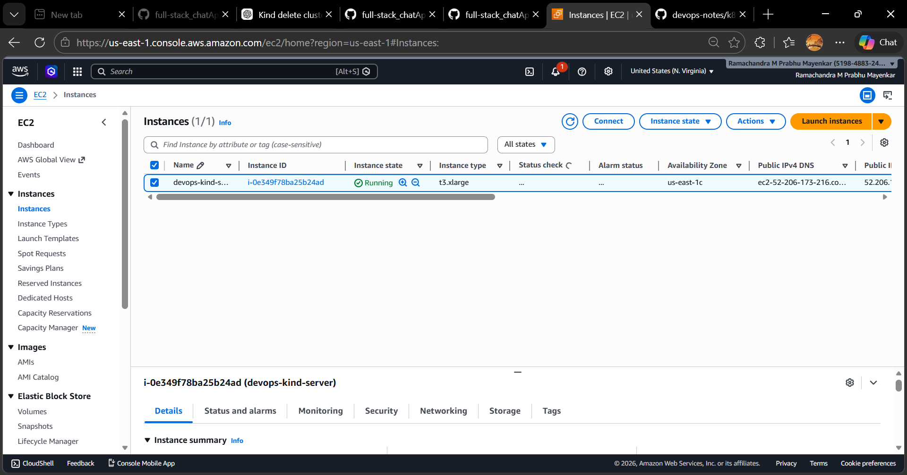

---

# 3. Server Configuration (Ansible)

Ansible automatically configures the server and installs the required DevOps tools.

## Installed Components

- **Docker** – Container runtime  
- **Jenkins** – CI/CD automation server  
- **Kind** – Kubernetes cluster running inside Docker  
- **kubectl** – Kubernetes command line tool  
- **Helm** – Kubernetes package manager  
- **Kind K8s Addons** – Additional Kubernetes components  
- **DevSecOps Addons** – Security and monitoring tools used in the pipeline  

These roles prepare the server to run the **CI/CD pipeline and Kubernetes workloads**.

### Ansible Setup

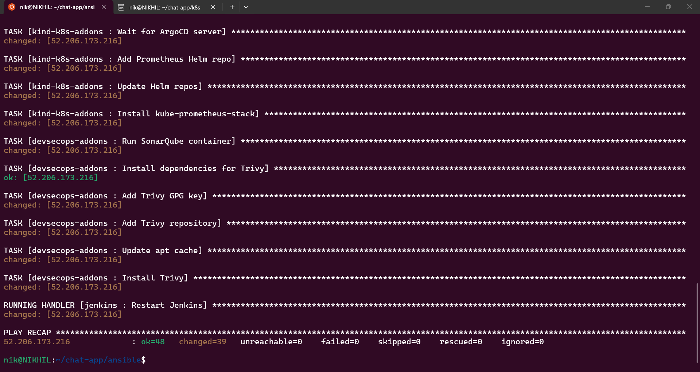

---

# 4. Jenkins CI/CD Pipeline

The Jenkins pipeline automates the **build, security scanning, containerization, and deployment** process.

It is designed to rebuild and deploy **only the services that were modified**, improving pipeline efficiency.

### Jenkins Pipeline (Manual Build Trigger that Builds Both Frontend and Backend Services)

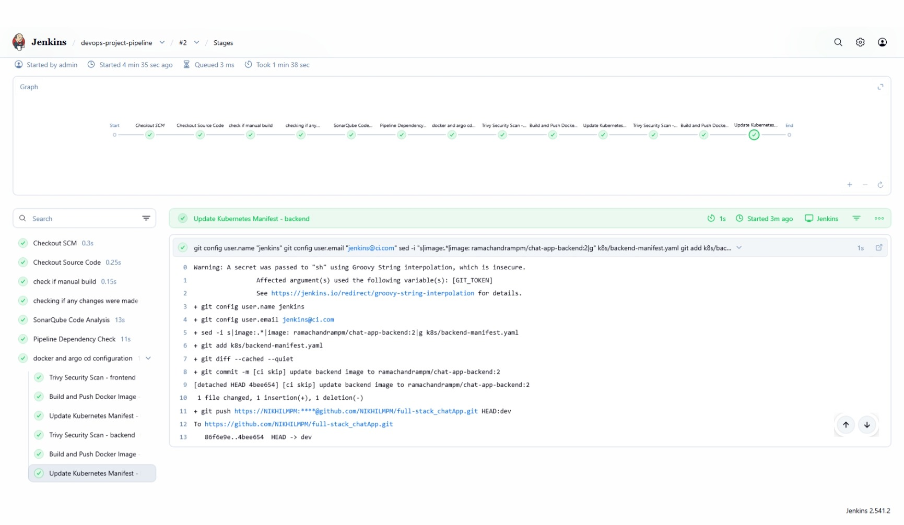

### Pipeline Triggers

### Frontend Trigger (Triggers when frontend code changes and builds and pushes only the frontend image to DockerHub)

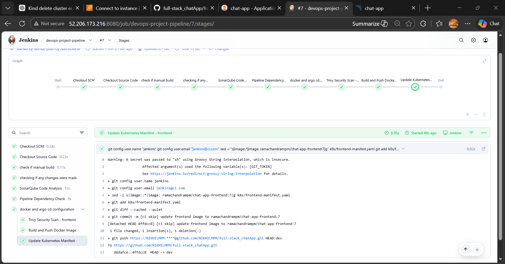

### Backend Trigger (Triggers when backend code changes and builds and pushes only the backend image to DockerHub)

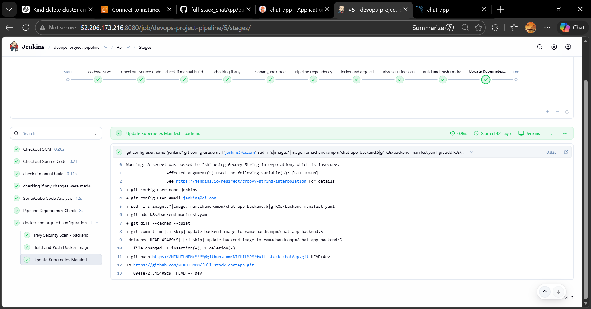

---

## Pipeline Workflow

### 1. Checkout Source Code

Jenkins pulls the latest version of the repository using the configured SCM.

### 2. Manual Build Detection

The pipeline checks whether the build was triggered manually.

- If **manual**, both frontend and backend services are selected for the pipeline.
- If triggered by a **Git commit**, the pipeline determines which services were modified.

### 3. Change Detection

Jenkins compares the latest commit with the previous one using:

```bash
git diff
```

It extracts the top-level folders (`frontend` or `backend`) that changed.

If no relevant changes are detected, the pipeline exits early to avoid unnecessary builds.

### 4. SonarQube Code Analysis

The project is scanned using **SonarQube** to analyze code quality, detect bugs, and identify security vulnerabilities.

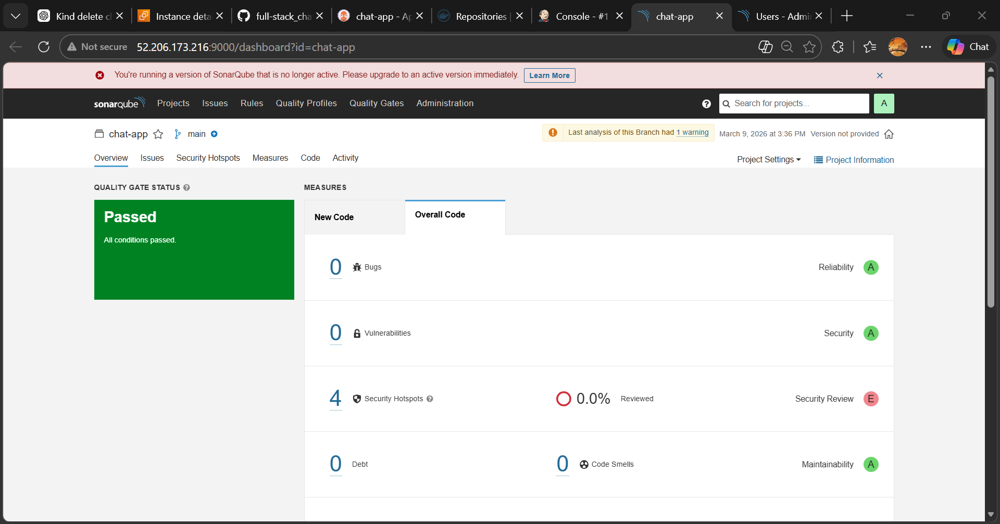

### 5. OWASP Dependency Check

The pipeline scans project dependencies to detect known vulnerabilities in third-party libraries.

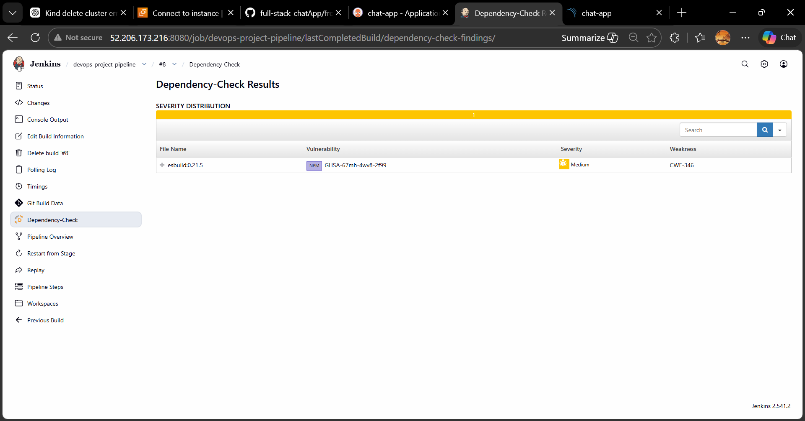

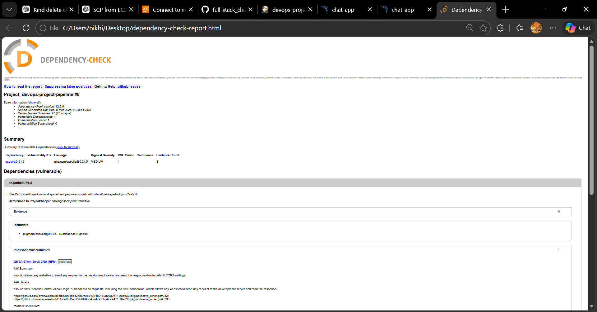

### 6. Trivy Security Scan

Before building the container image, **Trivy** scans the service source code directory for potential security risks.

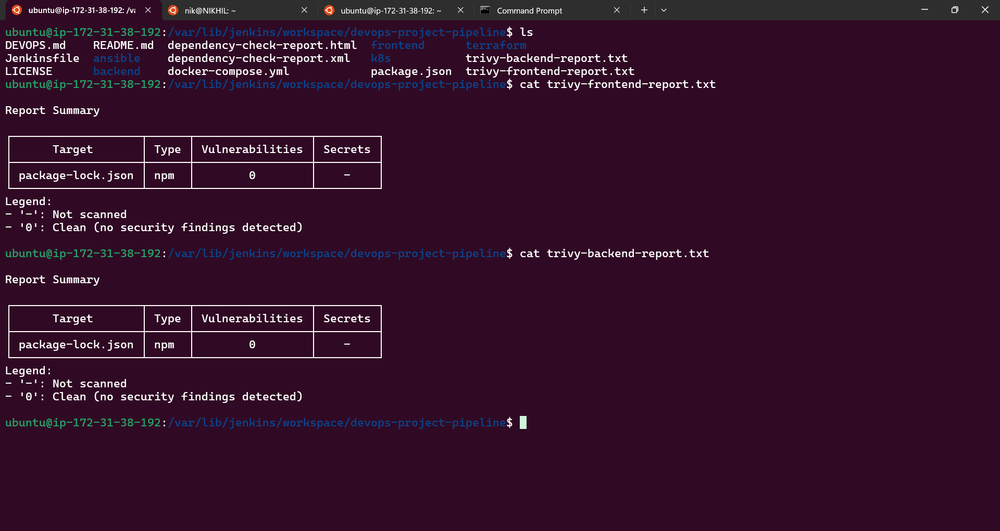

### 7. Docker Image Build and Push

For each modified service:

- A Docker image is built from the corresponding directory (`frontend` or `backend`)
- The image is tagged with the Jenkins **build number**
- The image is pushed to **DockerHub**

### DockerHub Images


### 8. Update Kubernetes Manifests

The pipeline updates the image tag inside the corresponding Kubernetes manifest file using `sed`.

### 9. Commit and Push Manifest Changes

Jenkins commits the updated manifest and pushes it to the Git repository.

### 10. GitOps Deployment via ArgoCD

Since ArgoCD continuously monitors the repository, it detects the manifest change and automatically **synchronizes the Kubernetes cluster**, deploying the new container image.

---

# 5. DevSecOps Security Scanning

Security checks are integrated directly into the CI pipeline to ensure the application is validated before deployment.

## Tools Used

- **SonarQube** – Performs static code analysis to detect bugs, code smells, and vulnerabilities.
- **OWASP Dependency Check** – Scans project dependencies for known CVEs.
- **Trivy** – Performs filesystem security scanning before container image creation.

This ensures the pipeline follows a **DevSecOps approach**, integrating security into every build.

---

# 6. Kubernetes Deployment

The application is deployed to Kubernetes using manifests for the **frontend**, **backend**, and **MongoDB** services.

## Frontend

- **Deployment** – Runs frontend application pods
- **Service** – Exposes the frontend internally within the cluster

## Backend

- **Deployment** – Runs backend API pods
- **Service** – Provides internal communication
- **Horizontal Pod Autoscaler (HPA)** – Automatically scales backend pods based on CPU usage

## MongoDB

- **StatefulSet** – Provides stable identity and persistent storage
- **Headless Service** – Enables stable networking for MongoDB pods
- **Persistent Volume (PV)** – Storage for database data
- **Persistent Volume Claim (PVC)** – Requests storage from PV
- **Secret** – Stores database credentials securely
- **Vertical Pod Autoscaler (VPA)** – Adjusts CPU and memory automatically

## Ingress

- **Ingress Resource** routes external traffic to the frontend service.

This architecture ensures **scalability, persistence, and high availability**.

---

# 7. GitOps Deployment (ArgoCD)

**ArgoCD** implements a GitOps deployment strategy for Kubernetes.

## Workflow

- Kubernetes manifests are stored in a **Git repository**
- ArgoCD continuously **monitors the repository**
- When manifests change, ArgoCD automatically **synchronizes the cluster**

### ArgoCD Application

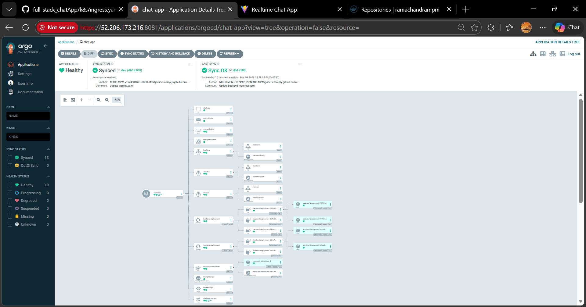

### ArgoCD Sync

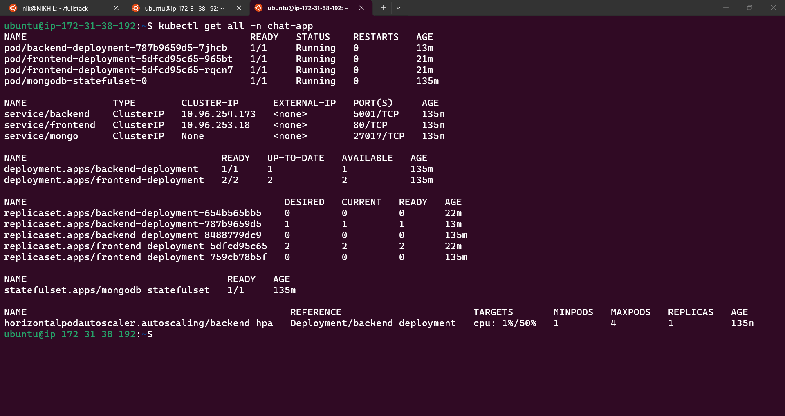

---

# 8. Monitoring (Prometheus + Grafana)

Monitoring is implemented using **Prometheus** and **Grafana**.

- **Prometheus** collects metrics from the Kubernetes cluster and applications.
- **Grafana** visualizes these metrics using dashboards.

### Prometheus Metrics

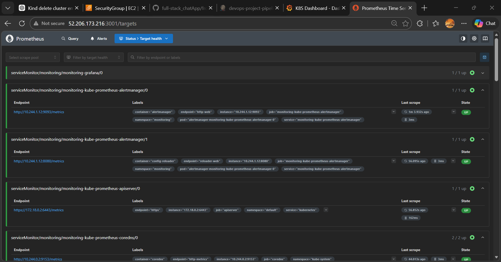

### Grafana Dashboards

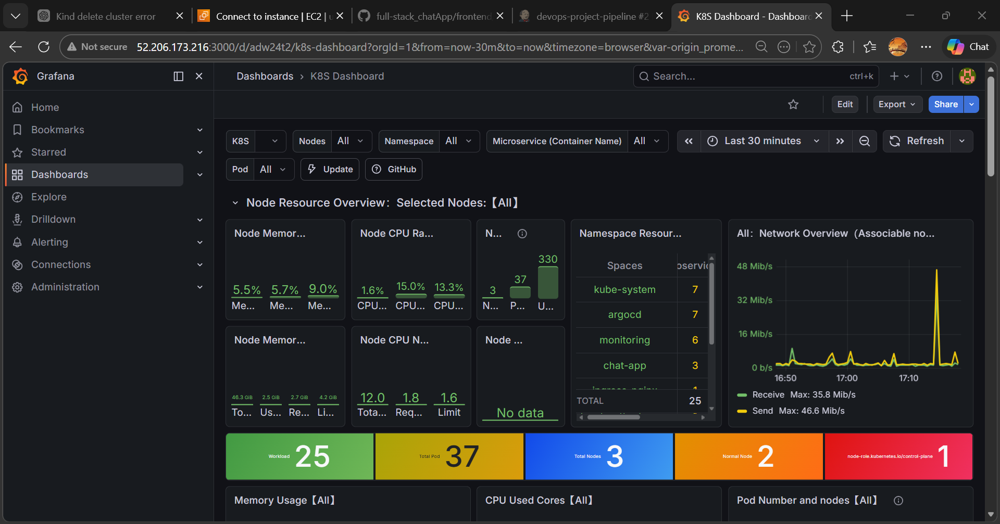

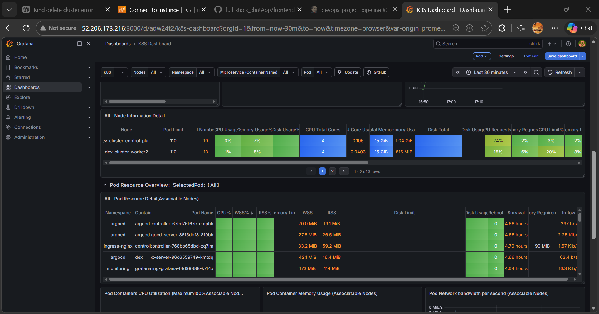

---

# 9. Application Working

The final deployed application running successfully in the Kubernetes environment.

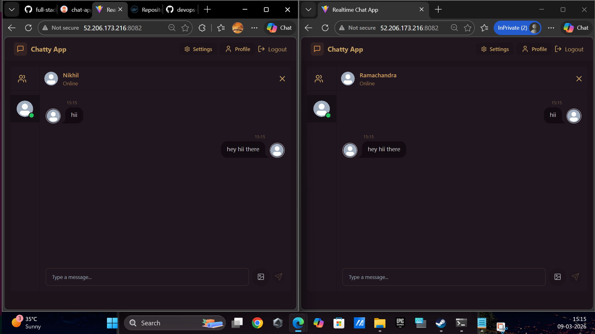

This project demonstrates how a modern **DevSecOps pipeline** can automate the entire software delivery lifecycle from infrastructure provisioning to production deployment and monitoring.

By integrating tools such as **Terraform, Ansible, Jenkins, Docker, Kubernetes, ArgoCD, Prometheus, and Grafana**, the system achieves:

- **Automated Infrastructure Provisioning** using Terraform
- **Automated Server Configuration** using Ansible
- **Continuous Integration & Delivery** with Jenkins
- **Containerization** using Docker
- **Security Integration (DevSecOps)** with SonarQube, OWASP Dependency Check, and Trivy
- **GitOps-based Deployment** using ArgoCD
- **Scalable Container Orchestration** with Kubernetes
- **Real-time Monitoring and Observability** using Prometheus and Grafana

The pipeline ensures that every code change goes through **automated testing, security scanning, containerization, and deployment**, enabling faster releases while maintaining security and reliability.

This architecture reflects **real-world DevSecOps practices used in modern cloud-native environments**, providing a scalable and production-ready workflow for deploying full-stack applications.

---
